# Gamut Compress
Gamut-compress is a tool which allows you to compress highly chromatic camera source colorimetry into a smaller gamut.

# What's a Gamut?
Let's start on a solid base of shared understanding. We usually work in RGB colorspaces. RGB colorspaces have 3 pixel values to represent color information: Red, green, and blue. A gamut is a coordinate system or a map which gives actual   meaning to these pixel values. A gamut is defined by its boundary, formed by 3 coordinates in the CIE 1931 xy chromaticity coordinate system. These coordinates are called the "primaries".

You have probably seen the CIE 1931 xy chromaticity diagram before.   
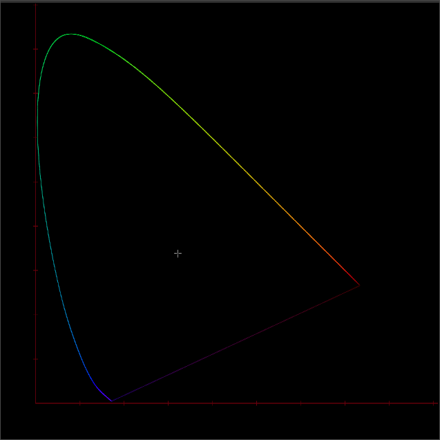  
This diagram is called the CIE 1931 "little x, little y" chromaticity diagram. The horseshoe shape is called the spectral locus, and represents the boundary of color visible to a human observer. With this coordindate system, we can represent any possible color using a 2d (x, y) coordinate.

## Quick Detour Into Spectral Power
But why is it called the "Spectral" locus? Human eyes are sensitive to a specific range of wavelengths on the electromagnetic spectrum. We perceive this electromagnetic energy as light and color with our visual system.
  (from the wikipedia article on [Spectral Colors](https://en.wikipedia.org/wiki/Spectral_color))

Our eyes have 3 cone cells, each with varying sensitivity to specific wavelengths. These cells are called L (for long wavelength red light), M (for medium wavelength green light), and S (for short wavelength blue light).

  
Above is a graph of human cone cell response to varying wavelengths of light.

The CIE1931 chromaticity diagram is a mathematical transformation of the 3 dimensional cone response curves into 2 dimensions. The xy chromaticity diagram is a useful visualization, but keep in mind a couple of things: it only represents color in an abstract non-perceptual way, and the luminance axis is not represented.

Light, both emitted and reflected, has a [Spectral Power Distribution](https://en.wikipedia.org/wiki/Spectral_power_distribution) (SPD).  
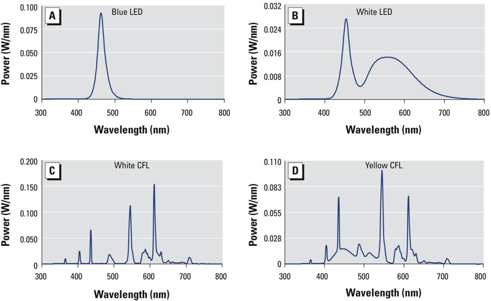  
(from [this article on how damaging blue light is to rat retinas](https://www.researchgate.net/figure/Light-source-SPD-curves-for-Ablue-LED-Bwhite-LED-Cwhite-CFL-and-Dyellow-CFL_fig2_259448948))  

Look at the SPD of the Blue LED. It is quite narrow and spiky. This "narrow-bandwidth" light is what we perceive as highly colorful.

  
(from [this article on light absorption in spinach leaves](https://www.researchgate.net/publication/38958266_Femtosecond_pump_probe_spectroscopy_for_the_study_of_energy_transfer_of_light-harvesting_complexes_from_extractions_of_spinach_leaves))  

Above is the SPD of light absorption in a spinach leaf. It has a more broad SPD. Most organic / non-manufactured objects do (with some obvious exceptions like beetles and flowers and hummingbirds). 

Therefore because of the physics of light and surfaces, light reflecting off diffuse objects have more broad spectral power distributions and will therefore appear less colorful than some artificial emitted light from an LED. One could say that reflected light has a colorfullness limit.

## Back to Our Chromaticity Diagram
With this basic knowledge of light physics, let's get back to the chromaticity diagram.

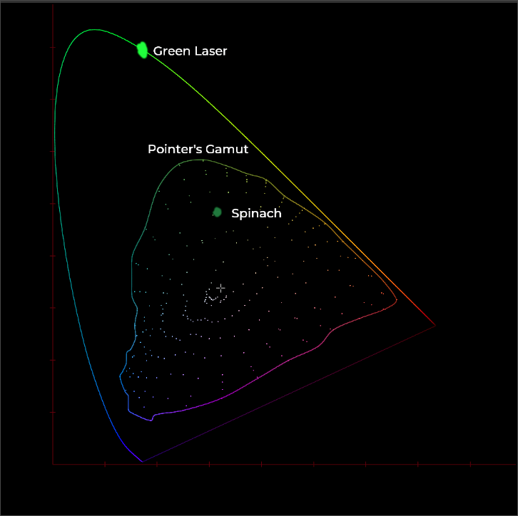  
On our chromaticity diagram, spinach might be located somewhere around the above location. A green laser, with a narrow spiky spectral power distribution, would be located very near to the spectral locus.

In the plot above I've also included [Pointer's Gamut](https://tftcentral.co.uk/articles/pointers_gamut), a sample set of reflective surface colors.

Reflective surface colors are clustered in a blob well within the spectral locus. More narrow-band light sources like lasers get further out, closer to the spectral locus, but will never cross the spectral locus. The spectral locus is an event horizon for human color vision.

For an RGB color gamut, the three primaries will form a triangle. If we plot the Rec709 gamut on the chromaticity diagram it would look like this:
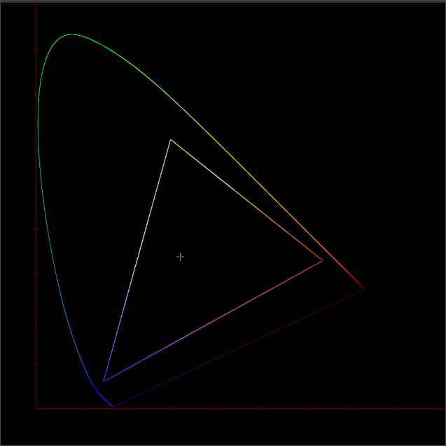  
Red, green and blue primaries each have an xy chromaticity coordinate. These coordinates define the _meaning_ of the encoded RGB values. Any combination +R, +G, +B will be within this triangle, inside of the Rec709 Gamut, and will have a defined xy chromaticity coordinate.

There are many gamuts that serve different purposes. The most common display gamuts are shown below. Chances are you are reading this on a Rec709 or P3 display right now.  
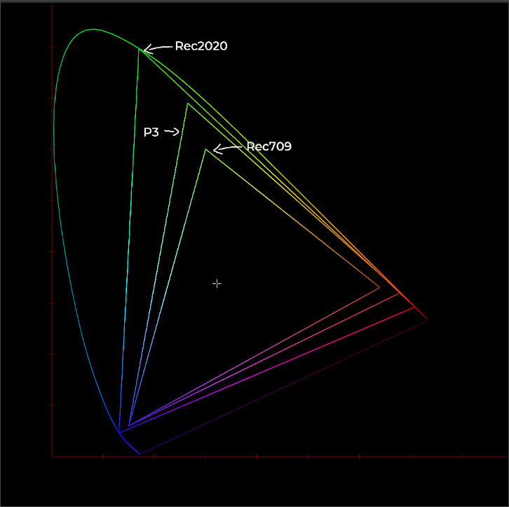  

Digital cinema camera systems also have their own gamuts.  
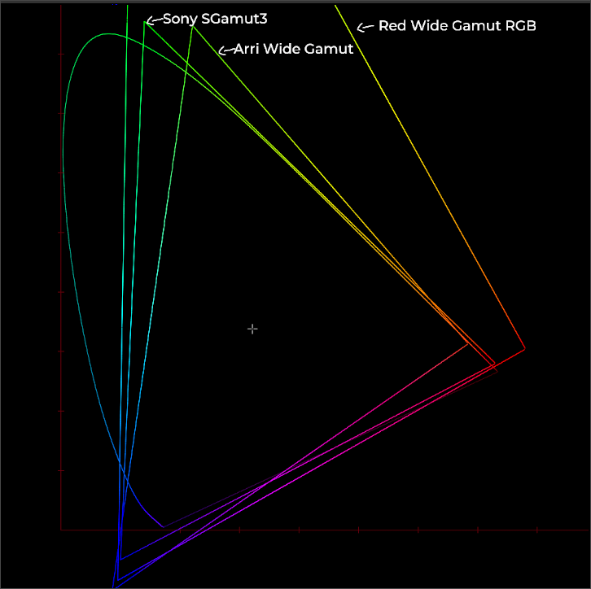  
Wait a minute... Why do these camera gamuts have RGB Primaries that are _outside_ of the spectral locus? This should not be possible!

# The Camera Observer
We saw earlier that the human observer has 3 cone cells sensitive to different ranges of the electromagnetic spectrum. 

Cameras mimic the human visual system. They have an image sensor, with many photosites arranged in a CFA pattern. Each photosite is sensitive to red green or blue light. These photosites have a spectral sensitivity just like human cone cells. 

However, _they are not the same as human cone cells_.  
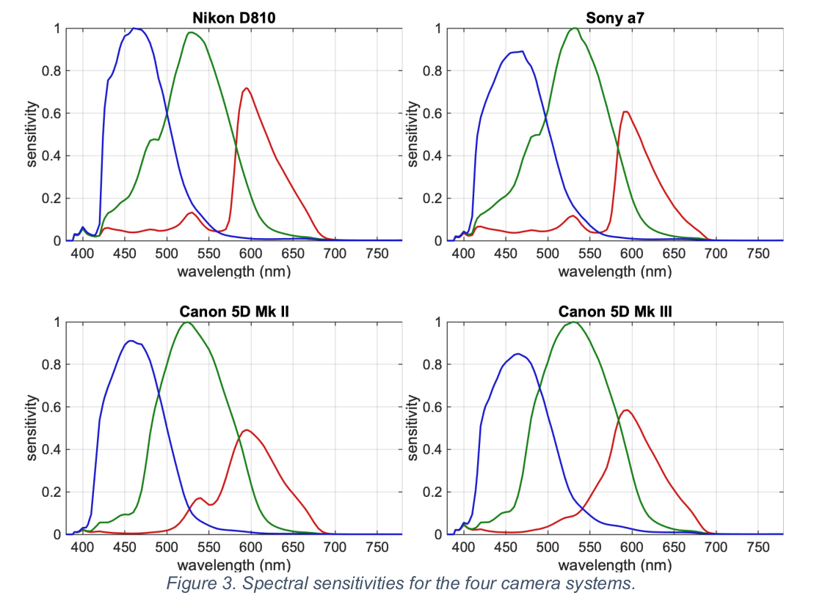  
Here is a selection of camera spectral sensitivities from [the ACES Results from an IDT evaluation](https://community.acescentral.com/t/results-from-an-idt-evaluation/2229/28). As you can imagine, each response would form a much different locus if plotted in xy chromaticity space. Somehow we must get from **Camera Vision** to **Human Vision**.

(Note: if interested in further reading, there is an interesting experimental procedure [here](https://www.gujinwei.org/research/camspec/) for calculating camera spectral response.)

# Camera Calibration
To get from camera native tristimulus data into RGB data that makes sense in relation to a human observer, there must be a calibration step. This transformation is sometimes called an "Input Device Transform or IDT". A 3x3 matrix is calculated   / optimized to transform a known set of color sample points under a known light source, into the right XYZ values. This set of sample points is usually within and around Pointer's gamut. Sometimes a Macbeth chart is used. The fit matrix aligns pretty closely for colors around these sample points, but aligns less closely for colors "further out". And in order to get this fit, often the coordinates of the primaries must be positioned outside of the spectral locus. 

And therefore we have imaginary primaries in camera encoding gamuts.

# So What's the Problem?
Well, if you are working in the camera source gamut, and using the camera display rendering transform, everything will be fine. Problems start to come into play if you choose a smaller working gamut compared to the camera gamut.  
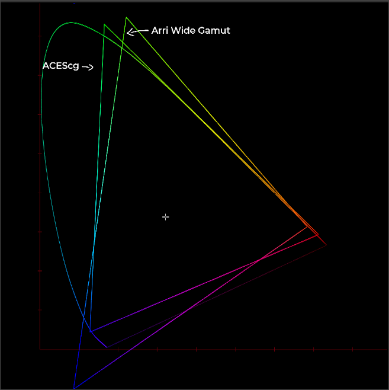  

Take ACES for example. The suggested working gamut is ACEScg, as shown above. You might think that if you convert your Arri Alexa Wide Gamut source images into ACEScg, everything would be fine.

But conversion might be the wrong word. Converting from one gamut to another does change the values of the pixels. However it does not actually change the colorimetric meaning of the pixel data. You could say that by converting between gamuts, you are changing _frame of reference_ to the same colors.

Let's look at an example - the infamous Blue Bar image.  
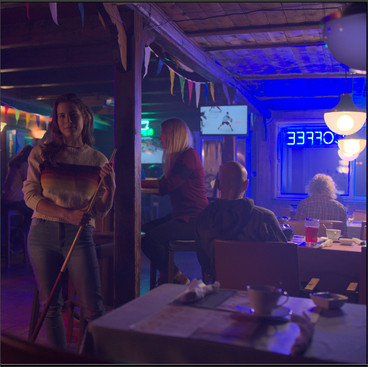  
This was shot with an Arri Alexa and it has a lot of highly chromatic blue light. 

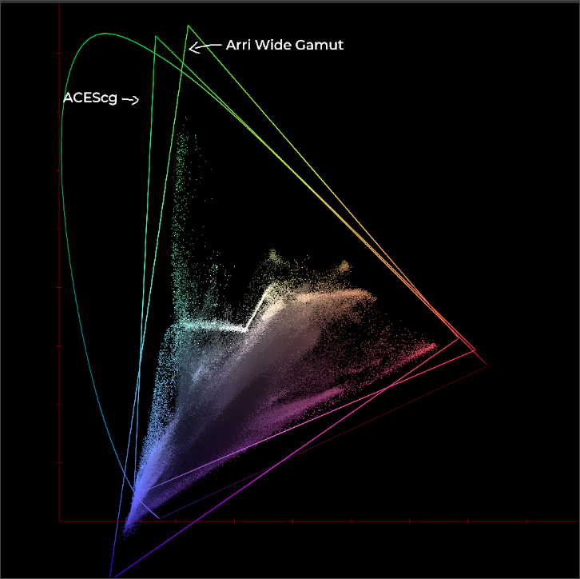  
Here is a plot of the chromaticities in the image, along with the gamut triangles for both Alexa Wide Gamut and ACEScg. A big chunk of the blue data is outside of the ACEScg gamut triangle.

To really drive this point home, here are a couple more examples. On the left is a plot of the encoding gamut, and the chromaticities in the image. On the right is the image data dumped directly to the display without any encoding. This is so that you can "see literally" what the pixel values are.

First we have the image and chromaticity data in **Alexa Wide Gamut**.  
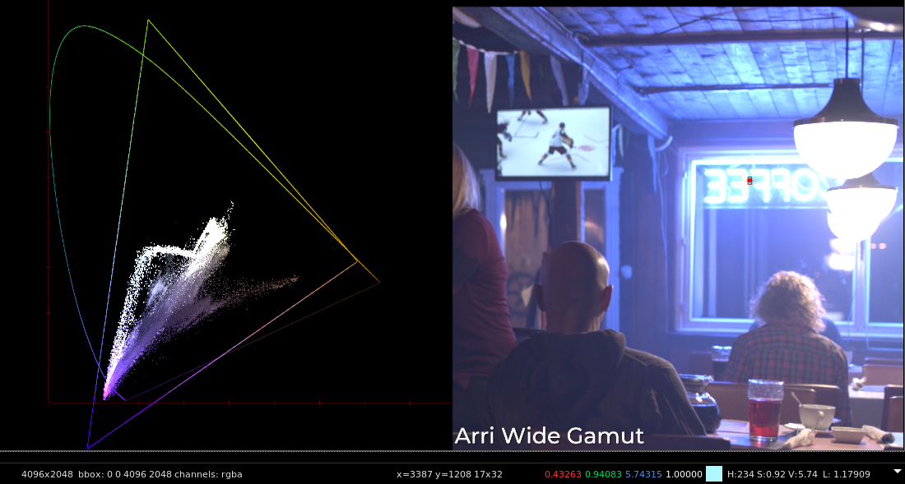  
All chromaticity data is within the encoding gamut triangle. A pixel sample near the neon lights yields all positive RGB values. 

Next is the image and chromaticity data in **ACEScg**.  
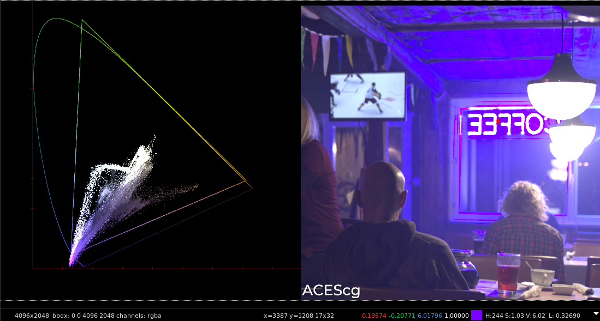  
The encoding gamut is now the smaller ACEScg triangle. The chromaticity data has not changed! A pixel sample near the neon lights yields negative values in the green channel. These pixels are **Out of Gamut** in ACEScg.

## Negative Values are A Pain
Depending on what you are doing, dealing with and preserving negative values in your images while you work on them might be problematic. If you are working in floating point as we often are in compositing, it might be possible to preserve the negative values through the pipeline. However, much can go wrong, and not all operators work well with negative pixel values. 

If you are working with any kind of integer image format, negative values will not be preserved.

## Depends on the Display Transform
If you do manage to preserve negative values in your workflow, these out of gamut values might not be an issue at all, depending on your display transform.  
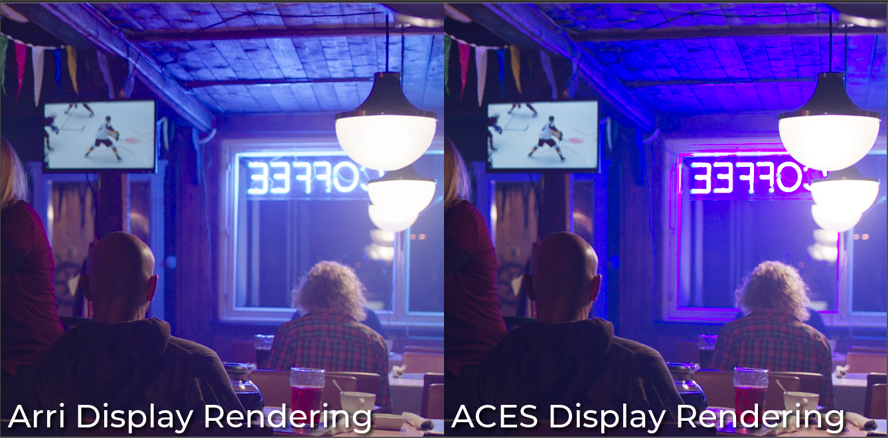

The Arri rendering looks fine. The ACES rendering looks bad. It looks bad because the ACES v1.2 display transform is a per-channel rendering that clips to its rendering gamut: ACEScg.

(Note: The result of the display rendering transform would be identical regardless of the encoding gamut, as long as the color is managed correctly into the display transform.)

# **Summary Points**
- Out of gamut negative pixel values are problematic for working on images and should be avoided if possible.
- A working gamut should be selected which encompasses the camera encoding gamut, as much as possible.
- If a smaller working gamut like ACEScg _must_ be used, and negative values _can_ be preserved and dealt with safely while working, everything may be fine if you are using a good display transform which can handle common digital cinema camera colorimetry for highly chromatic light sources.
- If you _must also_ use the ACES display transform, then in this last worst case you might want to use the Gamut Compress tool available here, but I wouldn't recommend it.

# About
This tool was developed as part of the [ACES Gamut Mapping Virtual Working Group](https://community.acescentral.com/c/aces-development-acesnext/vwg-aces-gamut-mapping-working-group/80). For more info check out the [working group proposal](https://www.dropbox.com/s/5hz8e07ydx0d2bm/ACES_Gamut_Mapping_Working_Group_Proposal_Approved.pdf).

Here is a contact sheet of [sample images](https://www.dropbox.com/sh/u6z2a0jboo4vno8/AAB-10qcflhpr0C5LWhs7Kq4a?dl=0) showing the visual appearance of highly chromatic camera source colorimetry rendered through the ACES Display Transform.

 

On the left are the original images with the ACES Rec.709 RRT display rendering transform applied. On the right are the same images, but with gamut compression applied.

## Implementations
DCC Implementations for the following software packages are included. For specific installation instructions, check out the documentation links for each package below.
- [Blinkscript for Nuke](docs/doc-nuke.md) (A [non-blinkscript node](GamutCompress.nk) is also provided for Nuke Non-Commercial).
- [Fuse for Fusion or Resolve Lite](docs/doc-fusion.md)
- [DCTL for Resolve Studio](docs/doc-resolve.md)
- [Matchbox for Flame, Scratch and Baselight](docs/doc-flame.md)

## Download
You can grab the latest "stable" release from the [Releases page](https://github.com/jedypod/gamut-compress/releases), or you can clone the repo to get the latest work. 

`git clone git@github.com:jedypod/gamut-compress.git`

## Documentation
For more information about [how the it works](/docs/gamut-compress-algorithm.md) and [how to use it](/docs/gamut-compress-documentation.md), please check out the [documentation](/docs).

## About
Written by Jed Smith in [collaboration](https://community.acescentral.com/t/rgb-saturation-gamut-mapping-approach-and-a-comp-vfx-perspective) with the [ACES Gamut Mapping Virtual Working Group](https://community.acescentral.com/c/aces-development-acesnext/vwg-aces-gamut-mapping-working-group). 

Also thanks to the contributions of [@nick-shaw](https://github.com/nick-shaw) for the initial versions of the DCTL and Matchbox implementations, and to Jacob Danell for the first version of the Fuse implementation.

If you are looking for the so-called "Reference" Gamut Compression adopted by ACES in version 1.2, you can find it [here](https://docs.acescentral.com/guides/rgc-user/). However I would not recommend using it for the following reasons:
1. It has a fixed parameterization for the per-channel compression settings, which will yield different results depending on the camera source colorimetry.
2. It uses a more aggressive compression function which does not distribute values as evenly, resulting in the need for lower threshold settings and more problematic inversion (if that is required).
3. It will result in distortion of the chromaticities as part of the compression. This may be fine for creative grading, but for more technical workflows like in VFX, a dominant-wavelength preserving compression may be desired instead.